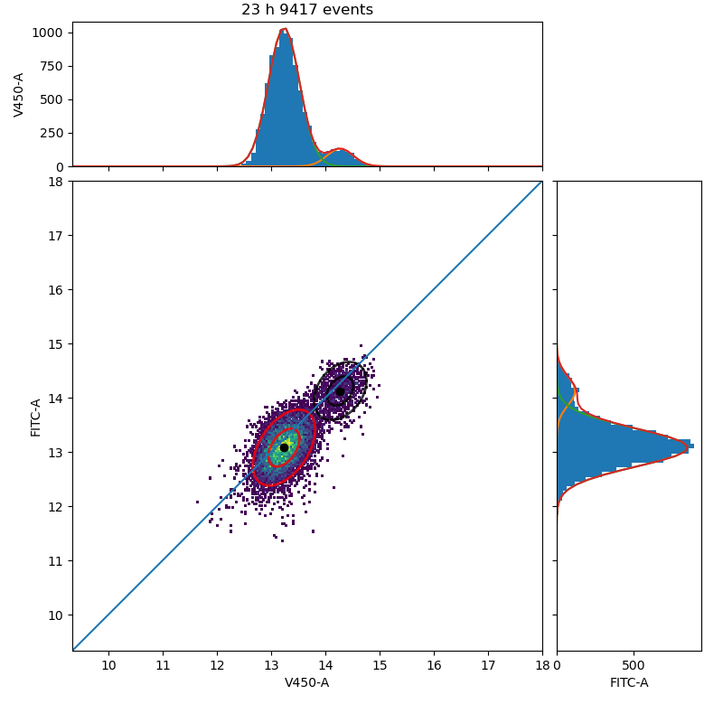
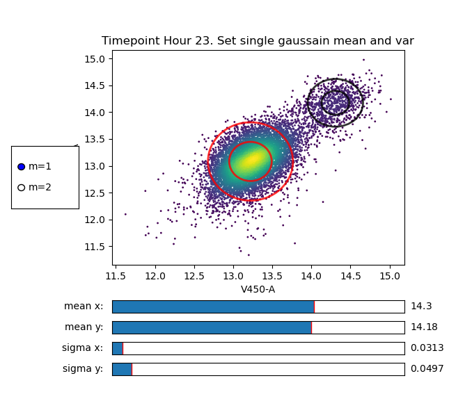

# fcGMM



The program requires the existence of a file descirbing were the cytofluorometer outpufiles are placed. 

```
folder1/
AutoFl:dataAF.fcs
0:data00.fcs
folder2/
18:data18.fcs
24:data24.fcs
folder3/
42:data42.fcs
48:data48.fcs
```
The name of the file may be something like `fileCTV-PKH.dat`, where `CTV` and `PKH` are the names of the fluorescence channel.

At the first execution we will run the program with the preprocessing flag:
```
python runFcGMM.py --preprocessing --dim 2 -i PKH-CTV
```
The `--dim` flag sets the number of dimensions that are taken in consideration in the Gaussian MIxture Model which can be from 1 to 3.
The `--preprocessing` flag allows to set the threshold for forward scattering (FSC-A) and
side scattering (SSCA). It also allows to threshold outliers using the estimate of the density function of the scatter plot computed using a Gaussian kernel.


Then to set the inital values of the Gaussian Mixture Model we run:
```
python runFcGMM.py --setInit --dim 2 -i PKH-CTV

```


As it is know the Gaussian Mixture Model relies heavily on the initial conditions that are set at the beginning of the Expectation Maximization algorithm. The `--setInit` flag opens an interactive window that allows us to set the initial values of centrists and the variances of the single Gaussian distributions forming the Gaussian Mixture Model.

Finally, to run the EM Gaussian Mixture Model we run:
```
python runFcGMM.py --dim 2 -i PKH-CTV
```

