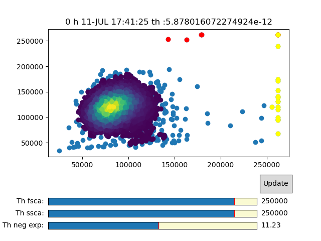

# fcMGM

The program requires the existence of a file descirbing were the cytofluorometer outpufiles are placed. 

```
folder1/
AutoFl:dataAF.fcs
0:data00.fcs
folder2/
18:data18.fcs
24:data24.fcs
folder3/
42:data42.fcs
48:data48.fcs
```
The name of the file my be someting like `fileCTV-PKH.dat`, where `CTV` and `PKH` are the names of the fluorescence channel.

At the first execution we will run the program with the preprocessing flag:
```
python runFcMGM.py --preprocessing --dim 2 -i PKH-CTV
```
The flag `-dim` set the number of dimation which can be 1 to 3.



Then to set the inital values of the mixture of Gaussians model we run:
```
python runFcMGM.py --setInit --dim 2 -i PKH-CTV
```
Finaly, to run the EM mixture of Gaussians model we run:
```
python runFcMGM.py --dim 2 -i PKH-CTV
```

